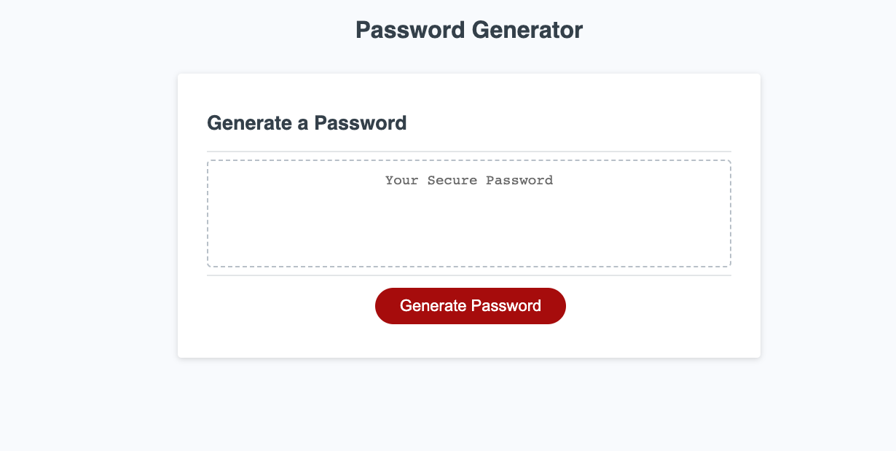

# Challenge5PasswordGen

* [Description](#description)
* [Purpose](#purpose)
* [Usage](#usage)
* [Screenshots](#screenshots)
* [License](#license)

## Description
This website contains a random password generator. Upon entering the the website, you're prompted with a series of questions regarding the type of characters you want in your random password, and how long you want it to be.

## Purpose
To create a random password.

## Usage
Open index.html in any browser.

## Screenshots

## License
MIT license - included in LICENSE

